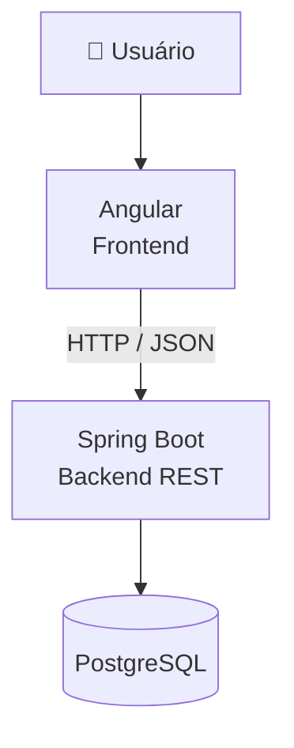

# 💙 EasyAzul

O **EasyAzul** é uma aplicação web desenvolvida para facilitar o uso e o gerenciamento do estacionamento rotativo da Área Azul.

A plataforma centraliza o controle de **usuários, veículos, zonas de estacionamento, reservas, tickets e pagamentos**, oferecendo diferentes funcionalidades de acordo com o perfil de acesso do usuário.

O projeto foi desenvolvido utilizando **Angular** no frontend, **Java com Spring Boot** no backend e **PostgreSQL** como banco de dados. A comunicação entre frontend e backend ocorre por meio de uma **API REST**, com autenticação baseada em **JWT** e controle de acesso utilizando **Spring Security**.

Além das funcionalidades da aplicação, o projeto utiliza **Docker**, **GitHub Actions**, testes automatizados, Pull Requests e versionamento automático para auxiliar no desenvolvimento e na qualidade do código.

---

## 🎥 Demonstração do MVP

Confira uma demonstração do EasyAzul em funcionamento:

https://github.com/user-attachments/assets/b2a7f083-7915-46f6-88bd-683b21e2a59e

---

## 🚀 Principais funcionalidades

### 👤 Usuários e autenticação

- Cadastro e autenticação de usuários
- Login utilizando JWT
- Controle de acesso baseado em perfil
- Perfis de Motorista, Fiscal e Administrador
- Validação de dados durante o cadastro

### 🚗 Veículos

- Cadastro e gerenciamento de veículos
- Consulta dos veículos vinculados ao usuário
- Identificação automática do veículo utilizado recentemente
- Seleção do veículo durante o processo de estacionamento

### 🗺️ Zonas de estacionamento

- Visualização das zonas através de mapa
- Integração utilizando OpenStreetMap
- Consulta das informações da zona
- Controle de capacidade e disponibilidade de vagas

### 🎫 Tickets e reservas

- Criação de tickets de estacionamento
- Reserva de estacionamento
- Acompanhamento do status do ticket
- Cancelamento e encerramento de tickets
- Renovação do estacionamento em **+30 minutos** ou **+1 hora**
- Contador de tempo restante do ticket
- Barra de progresso para acompanhamento do período utilizado
- Alertas quando o ticket estiver próximo do vencimento

### 💳 Pagamentos

- Consulta de pagamentos
- Gerenciamento dos pagamentos vinculados aos tickets
- Controle de status das operações

### 🛡️ Administração e fiscalização

- Gerenciamento de usuários
- Consulta de veículos
- Gerenciamento de tickets
- Consulta de pagamentos
- Funcionalidades específicas de acordo com o perfil autenticado

---

## 🏗️ Arquitetura

O EasyAzul utiliza uma arquitetura separada entre frontend, backend e banco de dados.



O **Angular** é responsável pela interface e interação com o usuário.

O **Spring Boot** concentra as regras de negócio, autenticação, autorização e comunicação com o banco de dados.

O **PostgreSQL** realiza a persistência das informações da aplicação.

---

## 🛠️ Tecnologias utilizadas

### Frontend

- Angular
- TypeScript
- HTML
- SCSS

### Backend

- Java 17
- Spring Boot
- Spring Security
- JWT
- Spring Data JPA
- Hibernate
- Flyway
- Maven
- API REST

### Banco de dados

- PostgreSQL 16

### Testes

- JUnit
- Mockito
- Angular Tests

### Infraestrutura e desenvolvimento

- Docker
- Docker Compose
- Git
- GitHub
- GitHub Actions
- IntelliJ IDEA
- DBeaver
- Postman / Insomnia

---

## 📦 Estrutura geral do projeto

```text
easyazul/
├── .github/
│   └── workflows/
│       ├── ci.yml
│       └── autoversion.yml
│
├── backend/
│   ├── Dockerfile
│   ├── pom.xml
│   └── src/
│       ├── main/
│       └── test/
│
├── frontend/
│   ├── Dockerfile
│   ├── package.json
│   ├── angular.json
│   └── src/
│       ├── app/
│       ├── assets/
│       └── environments/
│
├── docker-compose.yml
├── CHANGELOG.md
└── README.md
```

---

## 🔄 Integração contínua

O projeto utiliza **GitHub Actions** para executar automaticamente validações do frontend e backend durante o desenvolvimento.

O workflow de CI é executado em pushes e Pull Requests para as branches `develop` e `main`.

### Frontend

O processo realiza:

```text
Instalação das dependências
        ↓
Build da aplicação Angular
        ↓
Execução dos testes
```

### Backend

O processo realiza:

```text
Inicialização do PostgreSQL
        ↓
Configuração do Java 17
        ↓
Execução dos testes Maven
```

Para que uma alteração seja integrada à branch principal, os checks configurados devem ser concluídos com sucesso.

---

## 🔐 Proteção da branch principal

A branch `main` possui regras de proteção para aumentar a segurança do processo de desenvolvimento.

As alterações são realizadas por meio de **Pull Requests**, permitindo revisão do código antes da integração.

O fluxo utilizado é semelhante a:

```text
Branch de desenvolvimento
        ↓
Pull Request
        ↓
Code Review
        ↓
Frontend - Build and Tests ✅
Backend - Build and Tests  ✅
        ↓
Merge na main
```

Essa estratégia reduz a possibilidade de código não validado ser incorporado diretamente à versão principal da aplicação.

---

## 🏷️ Versionamento automático

O projeto possui um workflow responsável pela criação automática de versões.

O versionamento segue o formato:

```text
vMAJOR.MINOR.PATCH
```

Exemplo:

```text
v1.5.0
```

O processo automatizado realiza o cálculo da próxima versão, criação de tags Git e atualização do `CHANGELOG.md`, permitindo acompanhar a evolução do projeto ao longo do desenvolvimento.

---

## 📝 Changelog

O histórico das versões e principais alterações do projeto pode ser consultado no arquivo:

```text
CHANGELOG.md
```

O arquivo é atualizado pelo processo de versionamento automático.

---

# 🐳 Executando com Docker

A forma recomendada para executar o EasyAzul localmente é utilizando **Docker Compose**.

Dessa maneira, não é necessário instalar manualmente Java, Maven, Node.js, Angular CLI ou PostgreSQL.

## Pré-requisitos

Instale:

- [Docker Desktop](https://docs.docker.com/desktop/setup/install/windows-install/)
- [Git](https://git-scm.com/downloads)

Ferramentas como IntelliJ IDEA e DBeaver são opcionais.

---

## 1. Clonar o repositório

```bash
git clone https://github.com/JulianaForbici/easyazul.git
```

Acesse o diretório:

```bash
cd easyazul
```

---

## 2. Iniciar o Docker Desktop

Certifique-se de que o **Docker Desktop** está aberto e que o Docker Engine está em execução.

---

## 3. Subir a aplicação

Na raiz do projeto:

```bash
docker compose up --build
```

Na primeira execução, o processo pode levar alguns minutos devido ao download e à configuração das dependências.

O Docker Compose iniciará:

```text
easyazul-frontend
easyazul-backend
easyazul-db
```

---

## 4. Acessar a aplicação

Após a inicialização:

| Serviço | Endereço |
|---|---|
| 🌐 Frontend | http://localhost:4200 |
| ⚙️ Backend | http://localhost:8081 |
| 📚 Swagger | http://localhost:8081/swagger-ui/index.html |
| 🗄️ PostgreSQL | localhost:5433 |

Nas próximas execuções, caso nenhuma imagem precise ser reconstruída:

```bash
docker compose up
```

---

# 🗄️ Banco de dados

O PostgreSQL é criado automaticamente pelo Docker Compose.

### Conexão externa

Para acessar utilizando DBeaver ou outra ferramenta:

```text
Host: localhost
Porta: 5433
Banco: easyazul
Usuário: postgres
Senha: postgres
```

Dentro da rede Docker, o backend utiliza:

```text
db:5432
```

Os dados são armazenados em um volume Docker e permanecem disponíveis mesmo após a interrupção dos containers.

### Acessar pelo terminal

```bash
docker exec -it easyazul-db psql -U postgres -d easyazul
```

---

# ⏹️ Parando a aplicação

Para interromper a execução no terminal:

```text
Ctrl + C
```

Para remover os containers:

```bash
docker compose down
```

Os dados do PostgreSQL serão preservados.

Para remover também o volume e recriar completamente o banco:

```bash
docker compose down -v
```

> ⚠️ **Atenção:** este comando remove os dados armazenados no banco PostgreSQL do ambiente Docker.

---

# 🔐 Autenticação e autorização

O EasyAzul utiliza autenticação baseada em **JWT**.

Após o login, a API retorna um token utilizado nas requisições seguintes para acessar recursos protegidos.

O **Spring Security** é utilizado para controlar quais recursos podem ser acessados por cada perfil.

---

# 🧩 Perfis de usuário

### 🚗 Motorista

Pode gerenciar veículos, visualizar zonas, criar e acompanhar tickets, realizar reservas, renovar o estacionamento e consultar pagamentos.

### 🔎 Fiscal

Possui funcionalidades destinadas à consulta de veículos e tickets para apoiar a fiscalização do estacionamento rotativo.

### 🛡️ Administrador

Possui acesso às funcionalidades administrativas para gerenciamento e acompanhamento das informações do sistema.

---

# 🧪 Testes

O projeto possui testes automatizados tanto no backend quanto no frontend.

No backend:

```bash
cd backend
./mvnw test
```

No Windows:

```powershell
cd backend
.\mvnw.cmd test
```

No frontend:

```bash
cd frontend
npm test -- --watch=false
```

Os testes também são executados automaticamente pelo workflow de CI do GitHub Actions.

---

# 🔀 Fluxo de desenvolvimento

O projeto utiliza Git e GitHub para controle de versão e colaboração.

O desenvolvimento ocorre utilizando branches e Pull Requests:

```text
feature / bugfix
       ↓
    develop
       ↓
Pull Request
       ↓
      main
```

Antes da integração na branch principal, as alterações são submetidas às validações configuradas no repositório.

---

# 📌 Status do projeto

🟡 **Em desenvolvimento**

O EasyAzul está sendo desenvolvido como parte do **Projeto Integrador do curso de Tecnologia em Análise e Desenvolvimento de Sistemas**, com evolução contínua de funcionalidades e melhorias na experiência dos usuários.

---

# 👥 Equipe

- Anaís Queiroz Goedert
- Fernando Kenichi Takenouchi
- Guilherme Duarte da Costa
- Juliana Cristina Forbici

---

# 📄 Licença

Este projeto foi desenvolvido para fins **acadêmicos, de estudo e portfólio**.
